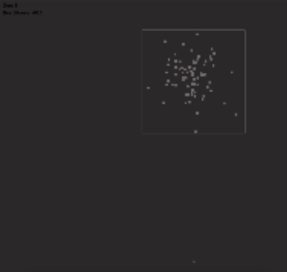

# Box-Evasion AI

Tiny Pygame + NEAT demo.

- Black square = ant.
- Red square = box that moves and shrinks.
- Goal: ant stays inside.

7 inputs -> 

Gap to left wall

Gap to right wall

Gap to top wall

Gap to bottom wall

Current box size (ratio of starting size)

Box horizontal velocity (dx)

Box vertical velocity (dy)

